# LAPORAN PRAKTIKUM JOBSHEET-03

## PRAKTIKUM 1
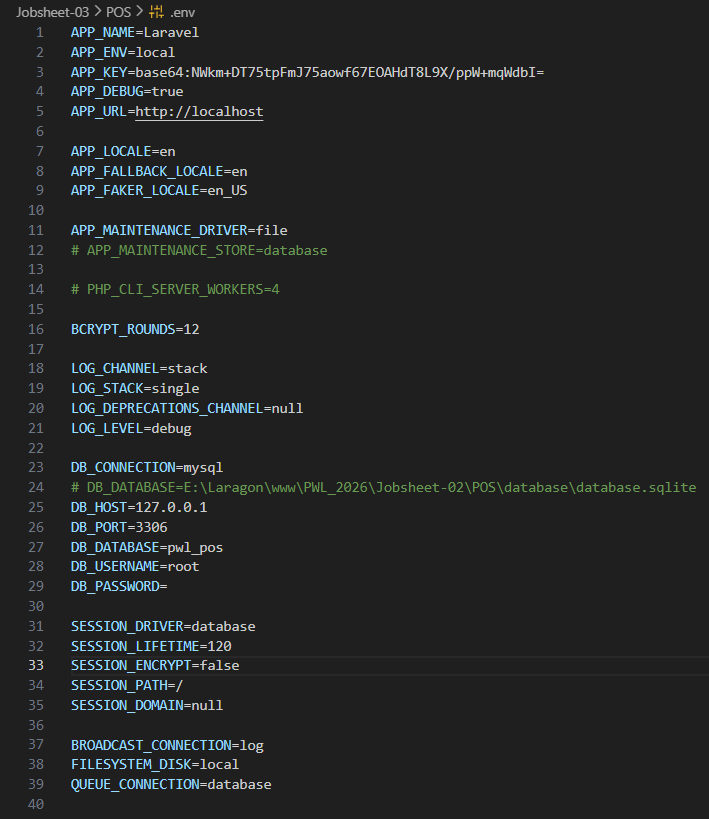

## PRAKTIKUM 2
### Praktikum 2.1
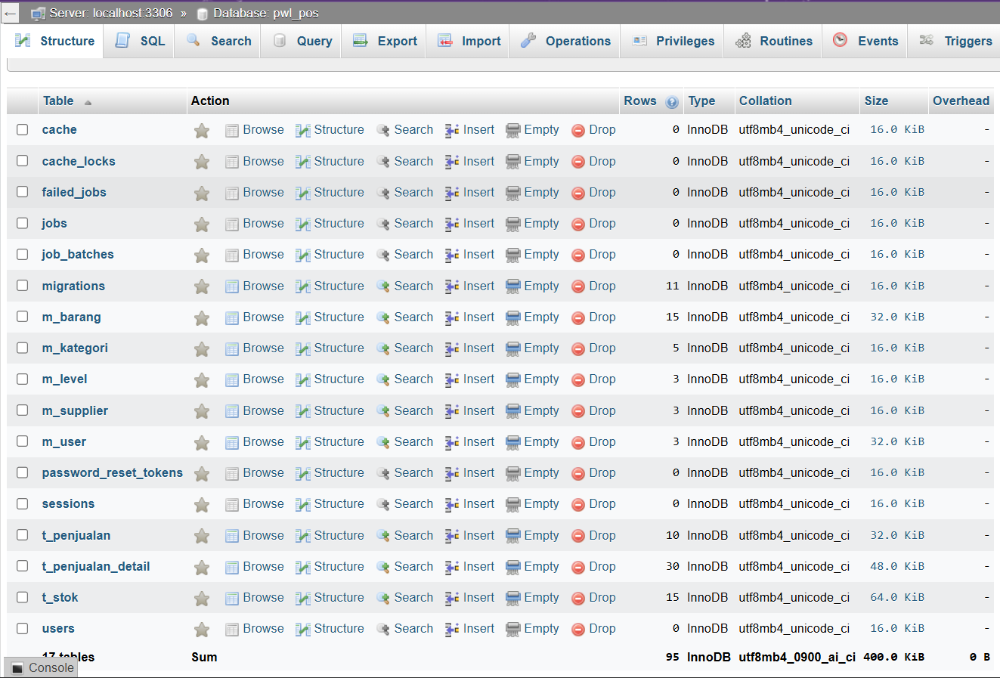

### Praktikum 2.2
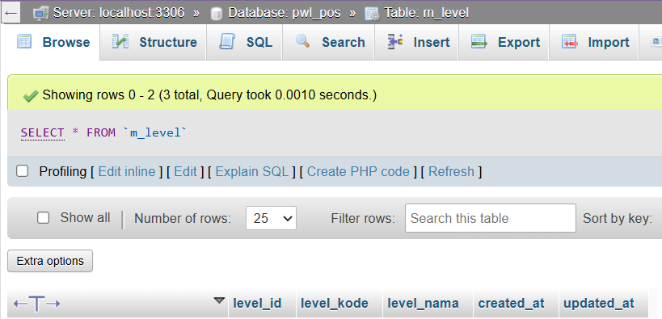
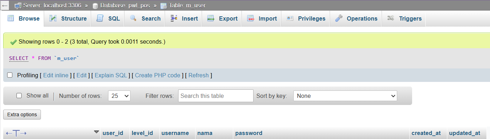
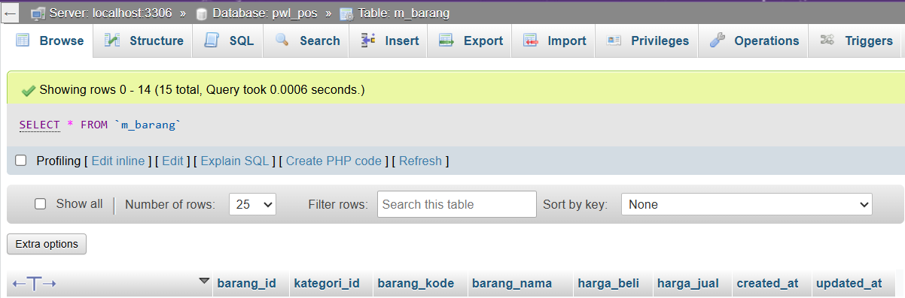
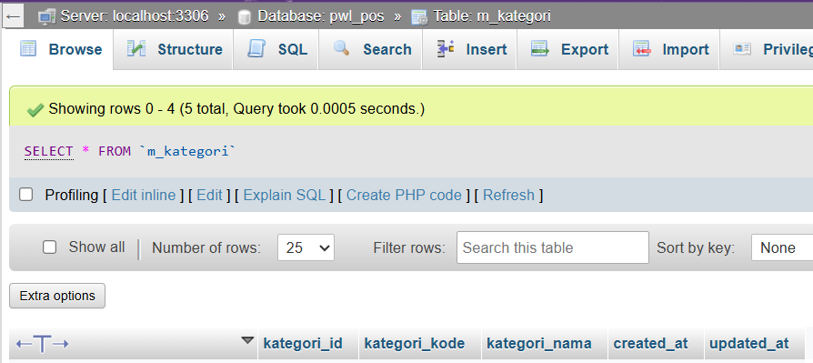
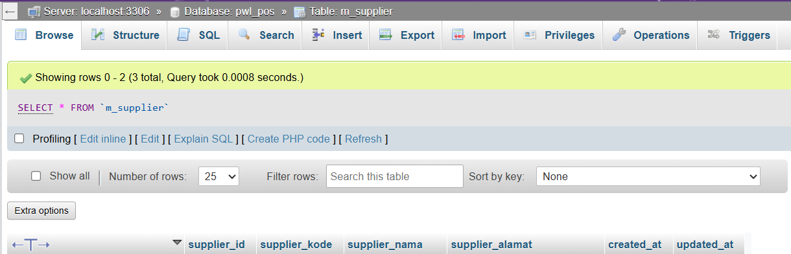
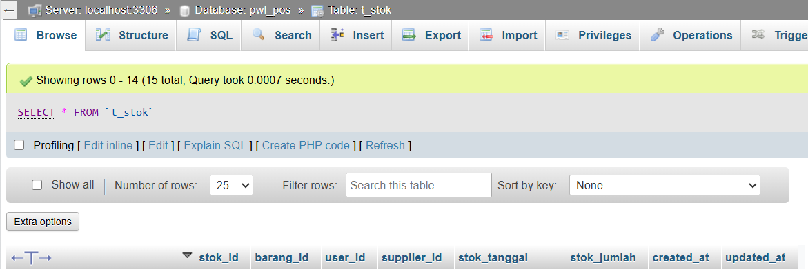
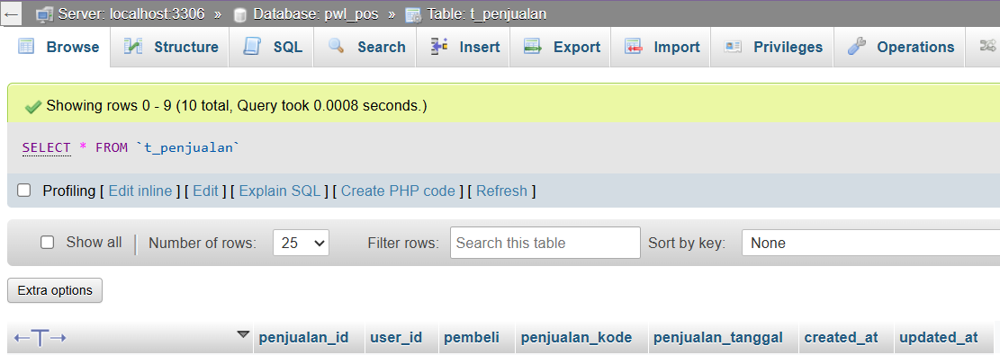
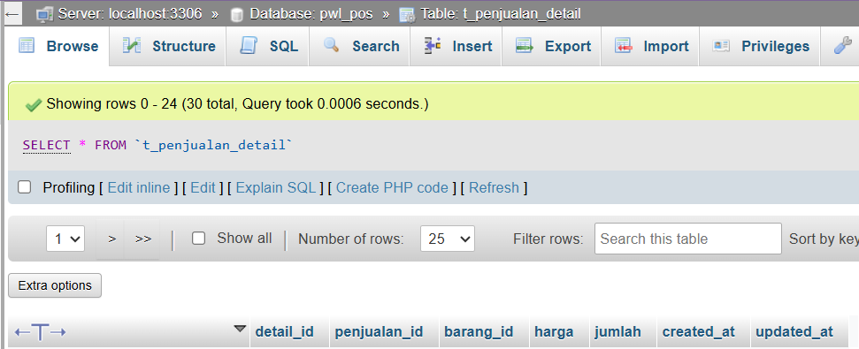

## PRAKTIKUM 3
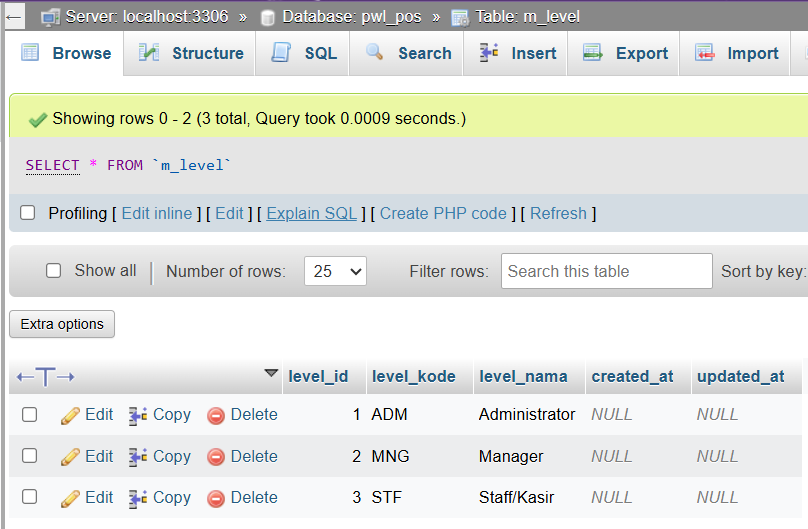
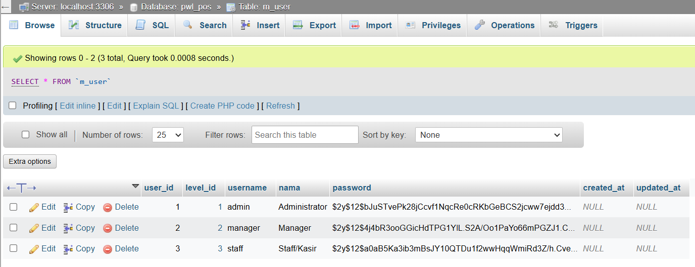
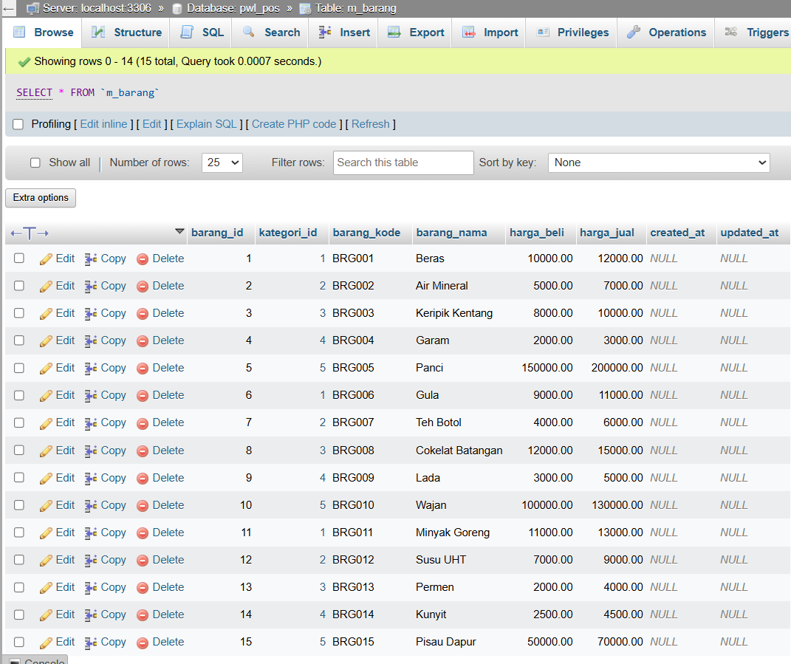
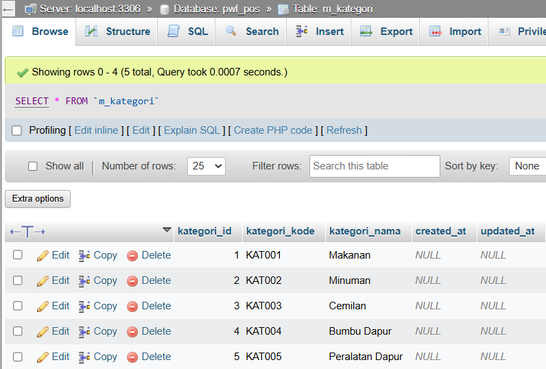
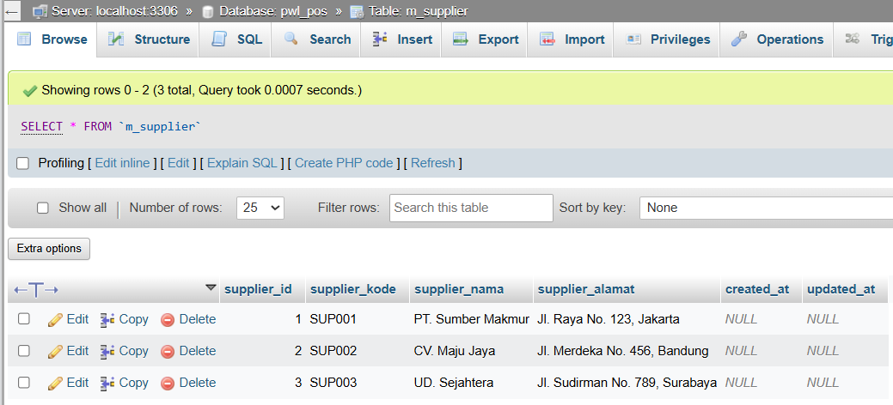
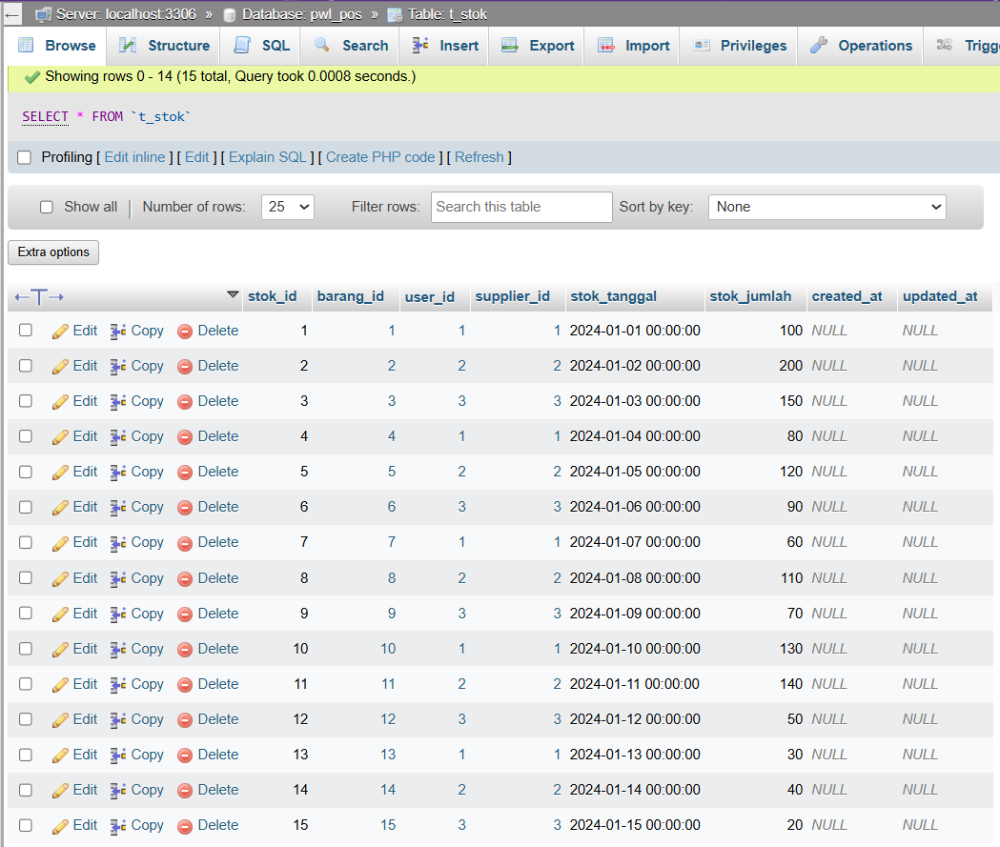
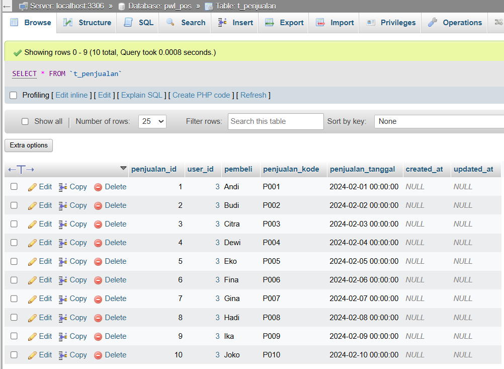
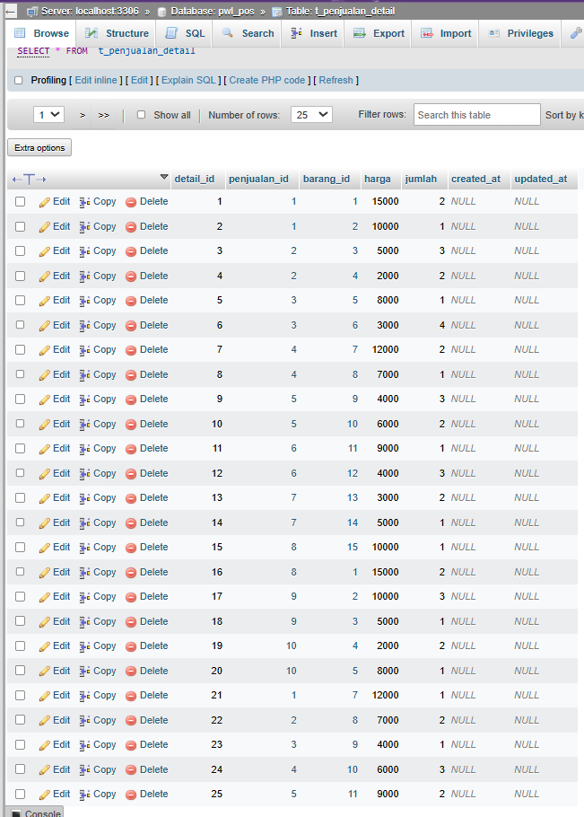

## PRAKTIKUM 4
### Insert/menambahkan data
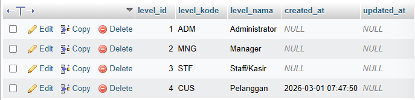

### Update/memperbarui data
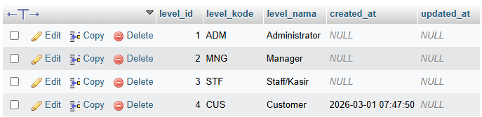
Note: Data level_nama di id ke-4 berubah/di-update dari Pelanggan menjadi Customer

### Delete/menghapus data
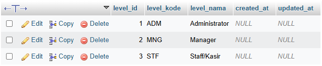

### Select/menampilkan data
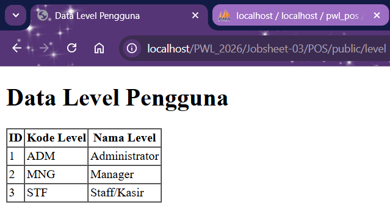

## PRAKTIKUM 5
### Menambahkan 1 data
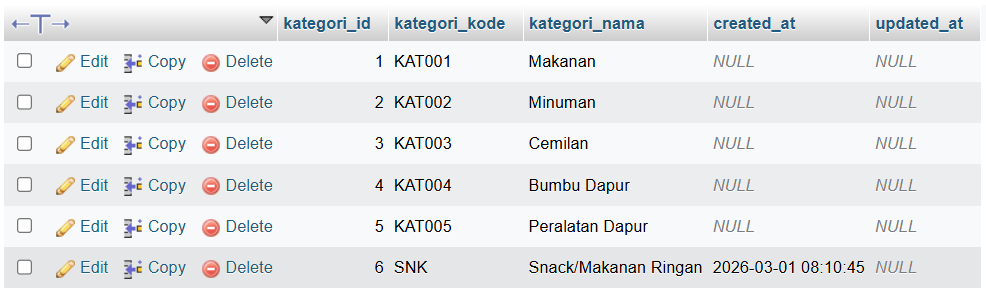

### Meng-update data
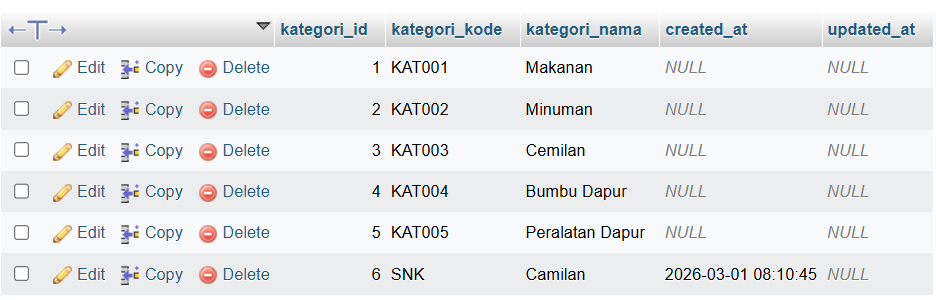

### Menghapus data
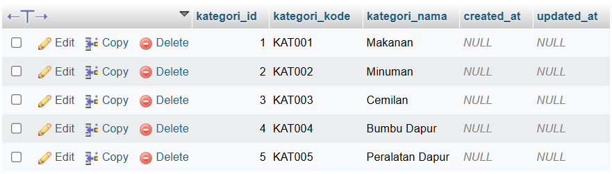

### Menampilkan data
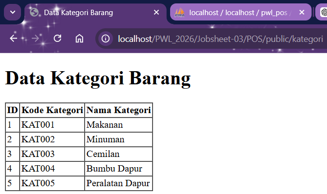

## PRAKTIKUM 6