# LAPORAN PRAKTIKUM JOBSHEET-03

## PRAKTIKUM 1
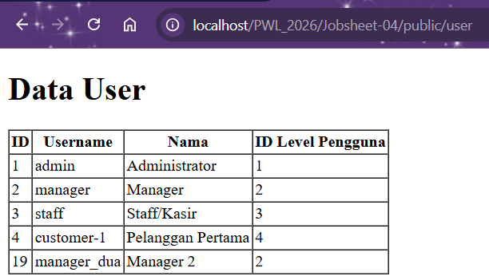
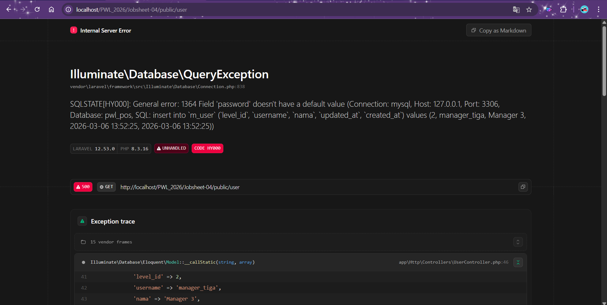
Error karena password dihapus dari $fillable sementara DB mewajibkan mengisinya. Kesimpulannya, data "Manager 3" tidak akan tersimpan ke dalam tabel m_user karena terbentur aturan keamanan Mass Assignment di Laravel.

## PRAKTIKUM 2
### Praktikum 2.1

### Praktikum 2.2

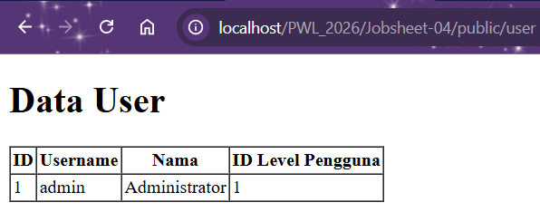
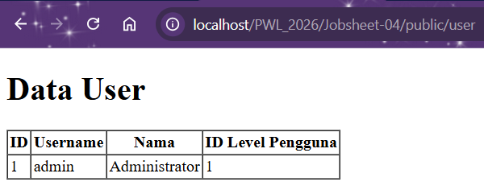
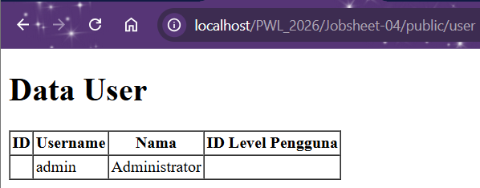
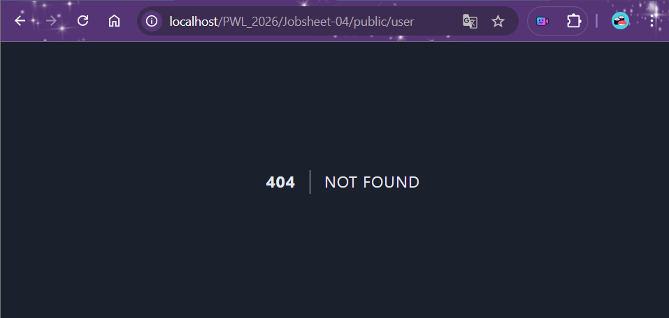
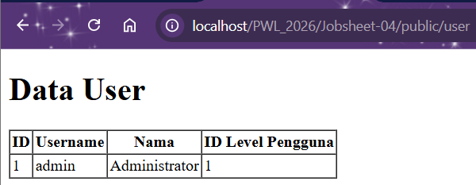
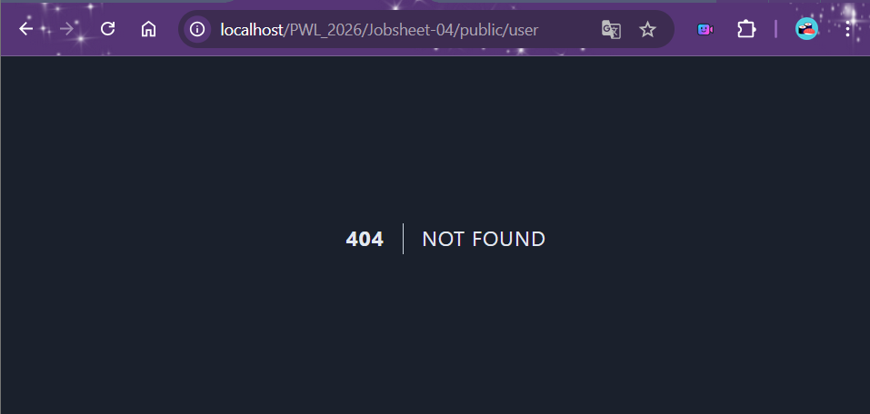

## PRAKTIKUM 3
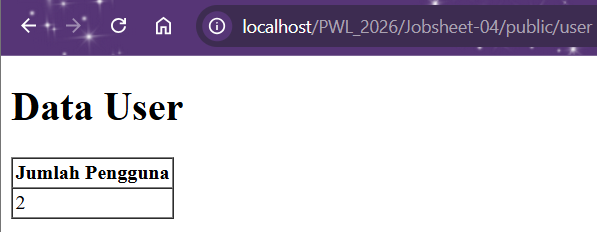
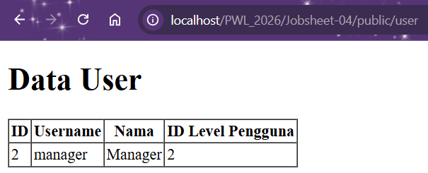
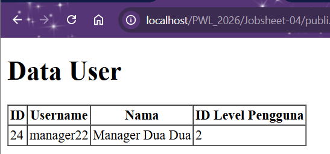
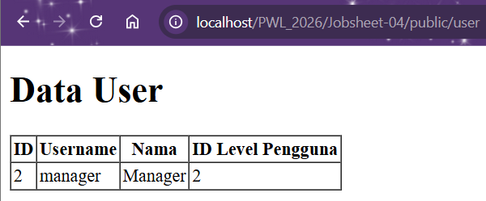
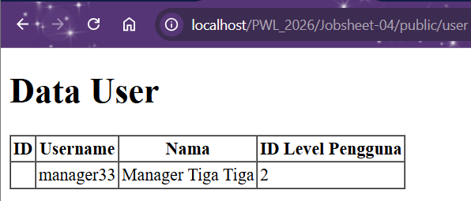
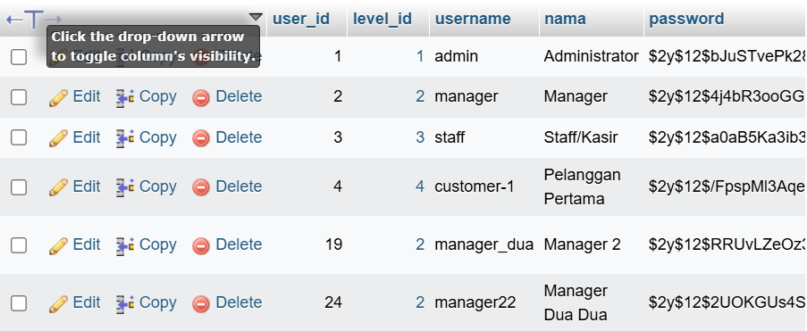
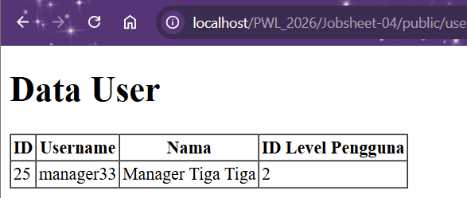
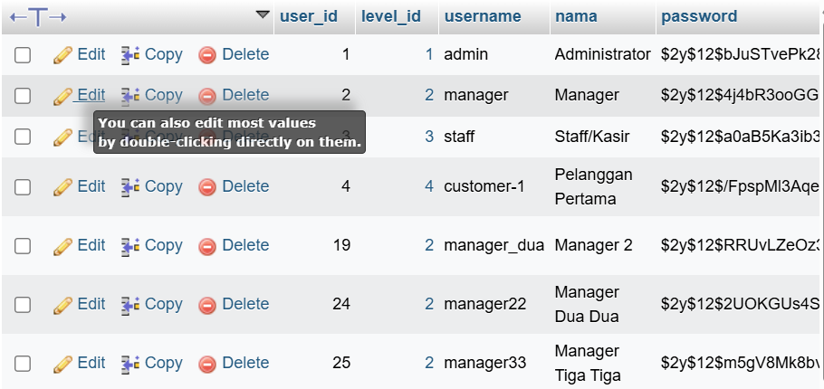

## PRAKTIKUM 4
### Insert/menambahkan data
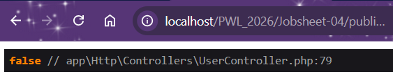

### Update/memperbarui data
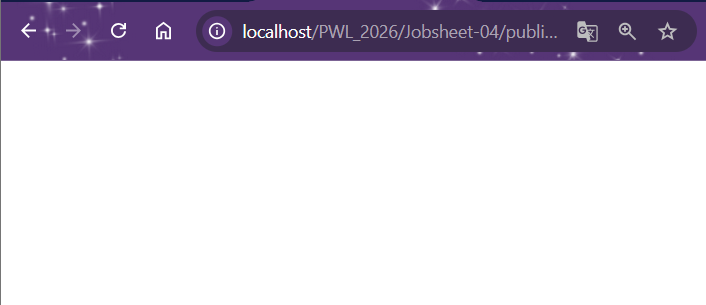
Note: Data level_nama di id ke-4 berubah/di-update dari Pelanggan menjadi Customer

### Delete/menghapus data
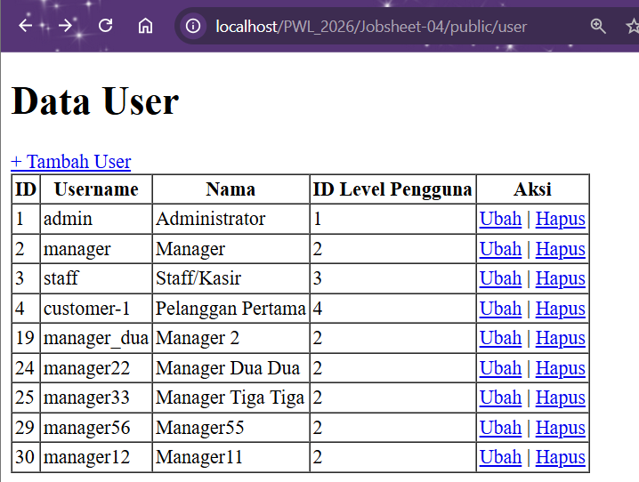

### Select/menampilkan data
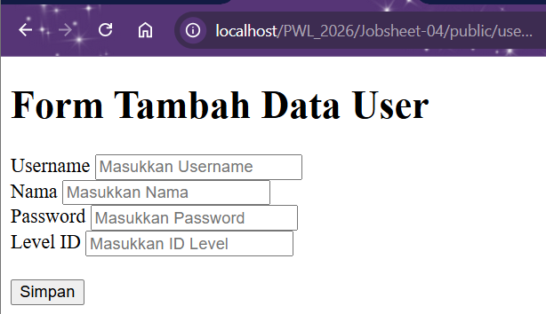

## PRAKTIKUM 5
### Menambahkan 1 data
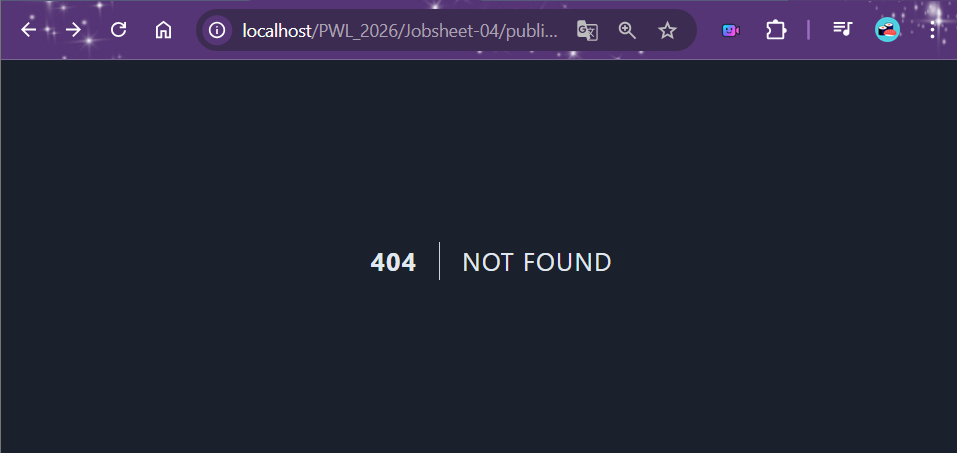

### Meng-update data
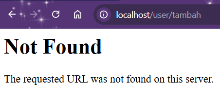

### Menghapus data
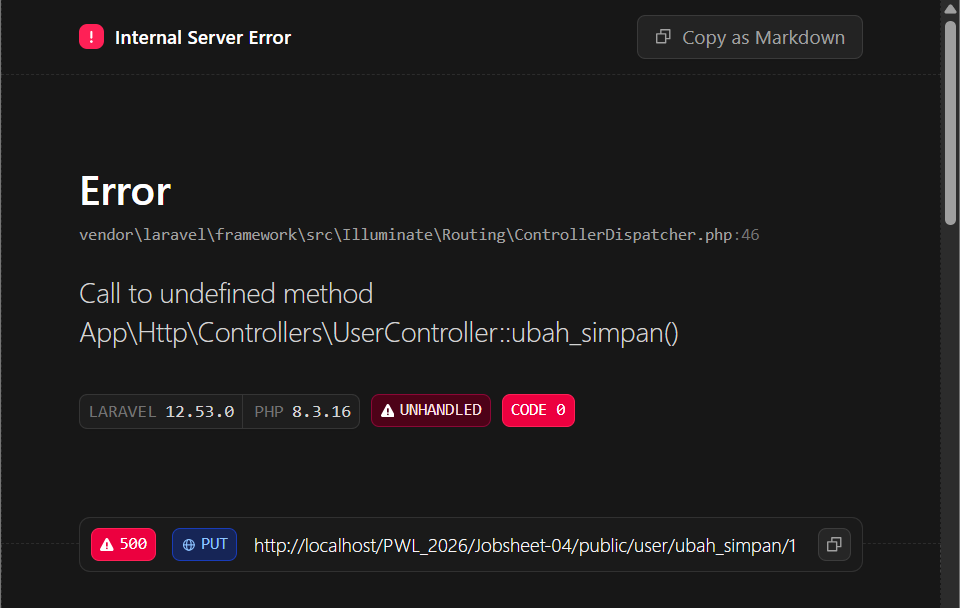

### Menampilkan data
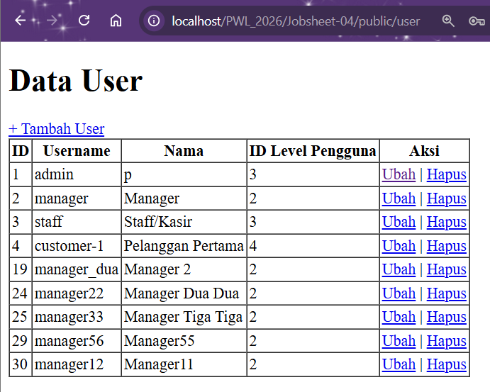

## PRAKTIKUM 6
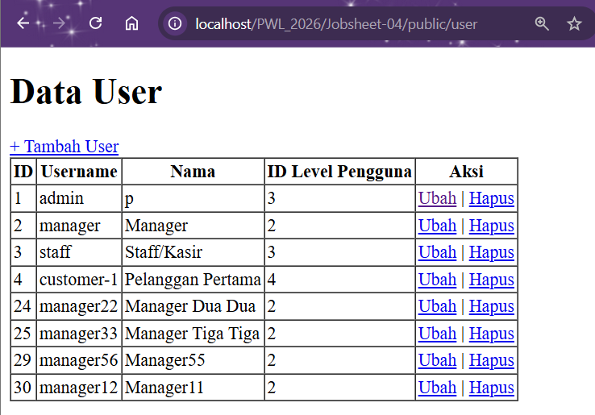

Note: menampilkan data pada tabel User

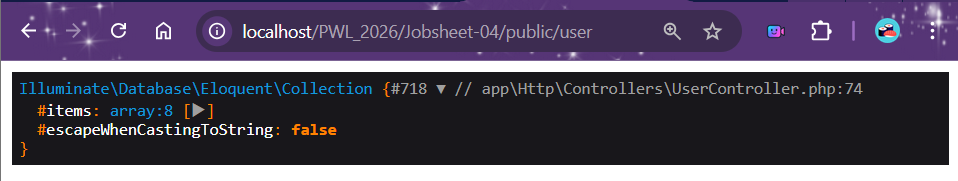
Note: Data error, karena mencoba memasukkan data ke tabel m_user, tetapi nilai pada kolom level_id tidak ditemukan di tabel referensinya, yaitu m_level. Dan karena ID 4 tidak ada di tabel m_level, database menolak data tersebut untuk menjaga konsistensi data.

### Solusi
Menambahkan level 4 

### Modifikasi UserController menggunakan Hash
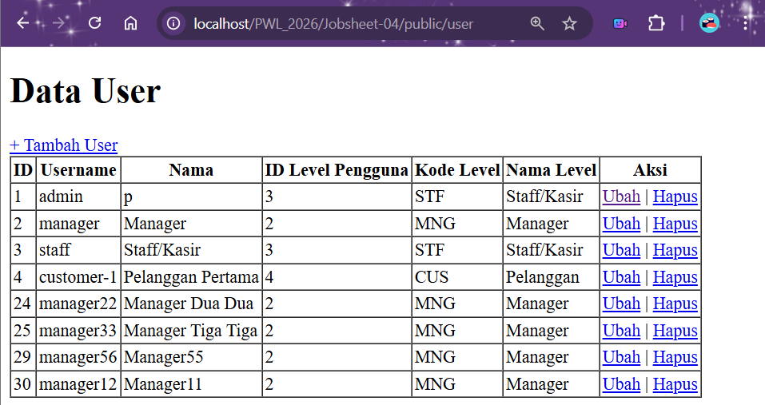

### Update data UserController  

## PENUTUP
1. Di dalam Laravel, APP_KEY digunakan untuk berbagai proses keamanan, terutama yang berhubungan dengan enkripsi dan keamanan data.
2. Masuk ke folder project Laravel kamu, lalu jalankan perintah 'php artisan key:generate'
3. Secara default Laravel punya 3 file migrasi bawaan, yaitu:
    - Tabel users → autentikasi
    - Tabel password reset tokens → reset password
    - Tabel failed jobs → pencatatan job queue yang gagal
4. Kode $table->timestamps(); berfungsi untuk menambahkan dua kolom otomatis ke dalam tabel, yaitu created_at (untuk menyimpan waktu saat data pertama kali dibuat (insert)) dan updated_at (untuk menyimpan waktu terakhir data diperbarui (update)). Jadi, secara umum $table->timestamps(); digunakan untuk mencatat waktu pembuatan & perubahan data, mendukung fitur audit sederhana, dan membantu tracking histori data.
5. Fungsi $table->id(); menghasilkan kolom primary key bertipe BIGINT UNSIGNED AUTO_INCREMENT yang digunakan sebagai identitas unik untuk setiap record dalam tabel.
6.  - $table->id(); => digunakan untuk membuat kolom id
    - $table->id('level_id'); => igunakan untuk membuat kolom level_id
7. Fungsi ->unique() digunakan untuk membuat kolom tidak boleh memiliki nilai yang sama, menjaga integritas data, dan membuat unique index di database.
8. Kolom level_id pada tabel m_user menggunakan $tabel->unsignedBigInteger('level_id') karena bukan auto increment dan untuk menyimpan referensi ke tabel lain (FOREIGN KEY). Sedangkan kolom level_id pada tabel m_level menggunakan $tabel->id('level_id') karena menjadi identitas unik setiap level (PRIMARY KEY).
9. Tujuan dari Class Hash adalah digunakan untuk mengenkripsi data sensitif, terutama password. Maksud dari kode program Hash::make('1234'); adalah jika database bocor, password asli tetap tidak bisa langsung diketahui.
10. Tanda tanya (?) pada query builder digunakan sebagai penanda nilai sementara yang nanti akan diisi oleh data yang kita kirimkan secara terpisah.
11. Tujuan penulisan kode protected $table = ‘m_user’; (untuk menentukan nama tabel yang digunakan model) dan protected $primaryKey = ‘user_id’; (untuk menentukan nama primary key yang digunakan model) adalah untuk mengatur konfigurasi tabel dan primary key secara manual, karena tidak mengikuti standar awal default Laravel.
12. Menurut saya, lebih mudah menggunakan Eloquent ORM karena sintaks sederhana & readable, tidak perlu menghafal banyak SQL, dan relasi antar tabel lebih simpel.