# LAPORAN PRAKTIKUM JOBSHEET-05

## PRAKTIKUM 1 - INSTALL FILAMENT
Data User tersimpan di database
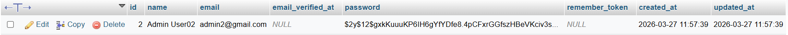

Halaman Login Filament
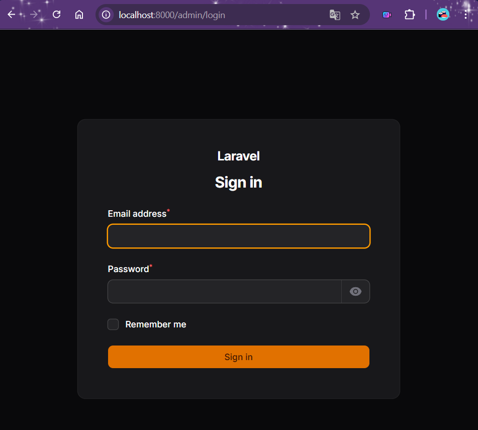

Dashboard Admin Dark Mode
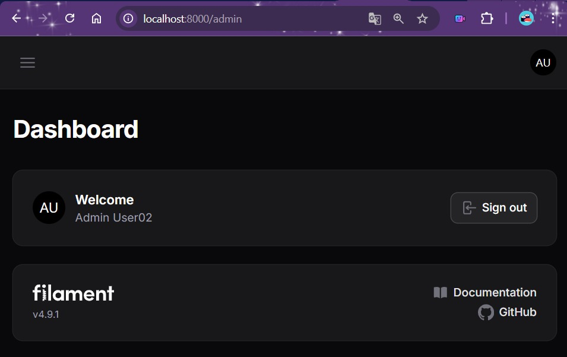

### E. Analisis & Diskusi
1. Apa kelebihan Filament dibanding membuat admin panel manual?
2. Mengapa Filament menggunakan Livewire?
3. Apa perbedaan SQLite dan MySQL dalam development?
4. Apa fungsi Panel Builder?

### Jawab:
1. Filament menggunakan Tailwind CSS yang tampilannya sudah modern. Fitur CRUD yang biasanya dibuat manual dengan waktu yang lama bisa selesai dalam hitungan menit melalui perintah terminal di Filament. Selain itu, fitur standar seperti Search, Filter, Pagination, Notification, dan Dark Mode sudah tersedia langsung tanpa perlu koding dari nol.
2. Karena Livewire memungkinkan Filament membuat antarmuka yang dinamis dan reaktiv (seperti React/Vue) tapi tetap menggunakan bahasa PHP. Livewire juga memudahkan developer Laravel karena tidak perlu berpindah-pindah antara bahasa PHP dan framework JavaScript yang kompleks.
3. 
    | Fitur | SQLite | MySQL |
    |------|------------|------------|
    | **Bentuk** | Berupa satu file tunggal dalam folder proyek | Sebuah layanan (service) server yang harus diinstal |
    | **Konfigurasi** | Nol. Langsung pakai (cocok untuk pemula/belajar) | Butuh setup username, password, dan port |
    | **Performa** | Sangat cepat untuk aplikasi kecil/personal | Sangat kuat untuk traffic tinggi dan data masif |
    | **Portabilitas** | Mudah dipindah-pindah (cukup copy filenya) | Harus di-export dan import lewat SQL dump
    
    Singkatnya: SQLite untuk mencoba ide atau belajar karena praktis.  MySQL (atau PostgreSQL) jika berencana merilis aplikasi ke publik (Production).
4. Panel Builder adalah jantung dari Filament. Fungsinya adalah sebagai kerangka kerja (framework) untuk membangun dashboard. Panel Builder menyediakan struktur untuk mengatur navigasi, resource, halaman kustom, dan tema untuk setiap panel tersebut secara terpisah namun tetap dalam satu basis kode.

## PRAKTIKUM 2 - MEMBUAT CRUD RESOURCE DENGAN FILAMENT V4

Struktur folder Resouce User terbentuk

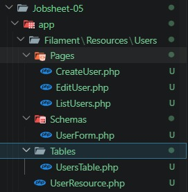

Muncul menu Users di sidebar
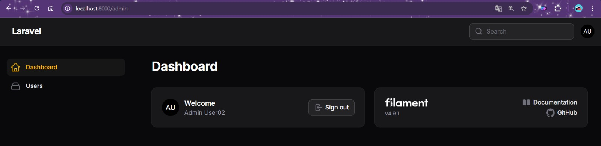

Tampilan jika user pada sidebar di klik
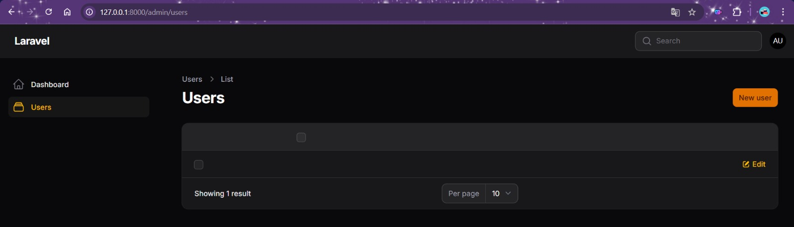

Jika diklik Create User masih belum ada form inputnya
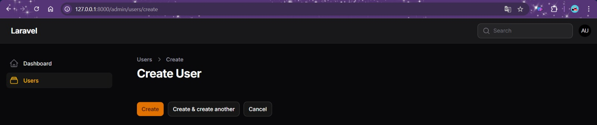

Membuat Form Input (Create dan Edit) dan mencoba menginputkan data
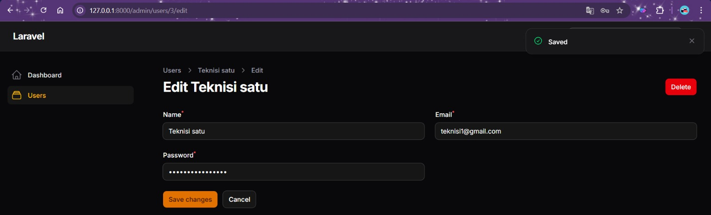

Data masuk ke database
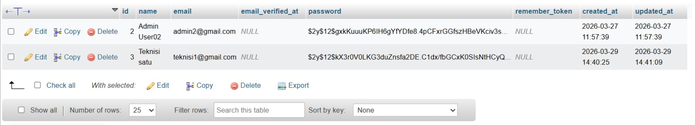

Tampilan pada halaman utama belum muncul apapun
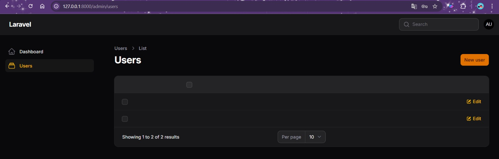

Menampilkan Data pada Tabel
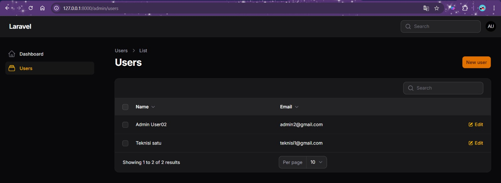

Mengganti icon Menu Resource

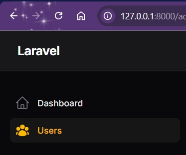

### I. Analisis & Diskusi
1. Mengapa Filament dapat membuat CRUD tanpa banyak coding?
2. Apa perbedaan Form Schema dan Table Schema?
3. Bagaimana jika kita ingin menambahkan validasi email unik?
4. Mengapa password tidak perlu kita hash manual?

### Jawab:
1. Karena Filament menggunakan code generation otomatis. Dengan menjalankan satu perintah artisan, Filament langsung membuatkan semua file yang dibutuhkan (halaman List, Create, Edit, Form, Table). Logika database tetap dikerjakan oleh Eloquent Laravel di balik layar, user hanya perlu mendefinisikan apa yang ingin ditampilkan, bukan bagaimana cara kerjanya.
2. - Form Schema (UserForm.php) → mengatur input data (field Name, Email, Password pada halaman Create & Edit). Digunakan saat menulis data (input user).
- Table Schema (UsersTable.php) → mengatur tampilan data (kolom yang muncul di halaman List). Digunakan saat membaca data (menampilkan daftar).

3. Tambahkan ->unique() pada field email di UserForm.php. Contohnya:
TextInput::make('email')
    ->email()
    ->required()
    ->unique(table: 'users', column: 'email', ignorable: fn ($record) => $record)
ignorable digunakan agar saat Edit, email milik user itu sendiri tidak dianggap duplikat.

4. Karena model User Laravel sudah memiliki cast hashed secara default. Jadi setiap kali password disimpan ke database lewat Eloquent, Laravel otomatis mengenkripsinya tanpa perlu kita tulis Hash::make() secara manual.

## PRAKTIKUM 3 - MEMBUAT MIGRATION, MODEL, RELASI, DAN RESOURCE CATEGORY

Membuat Model & Migration Category

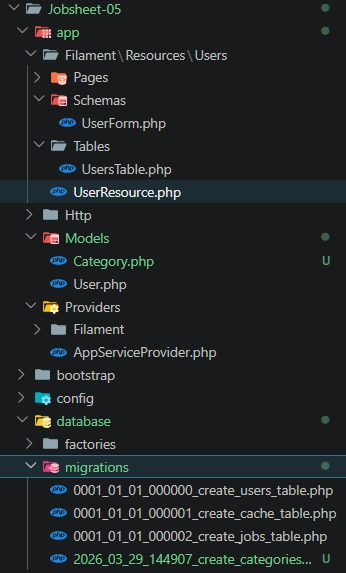

Mendesain Tabel Categories yang terhubung dengan Database
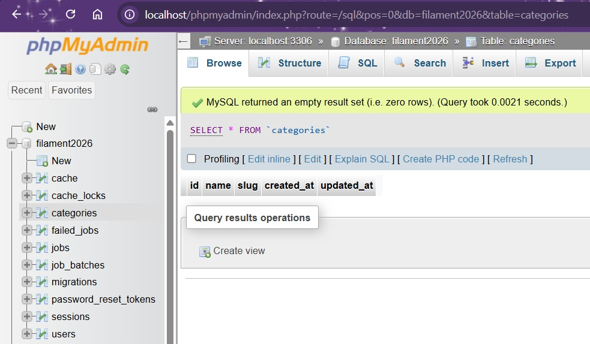

Mendesain Struktur Tabel Posts
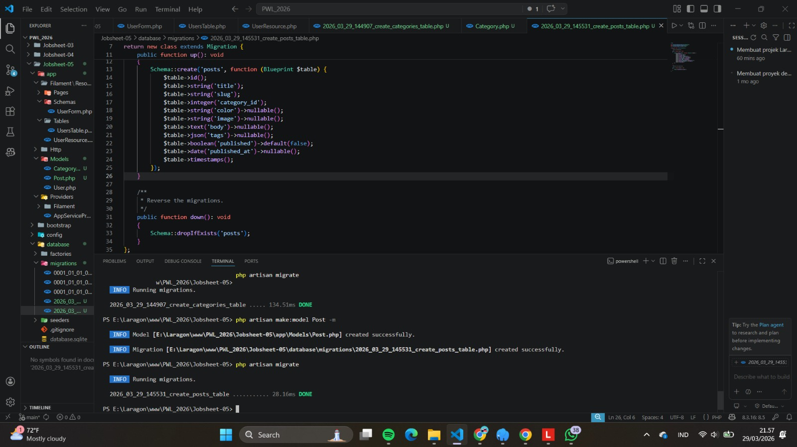

Membuat Resource Category di Filament
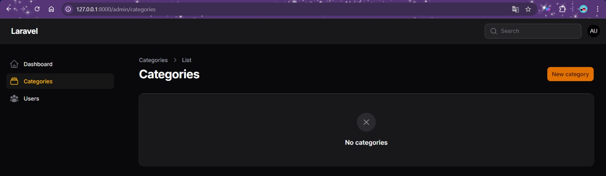

Edit Form Category agar ada Formnya
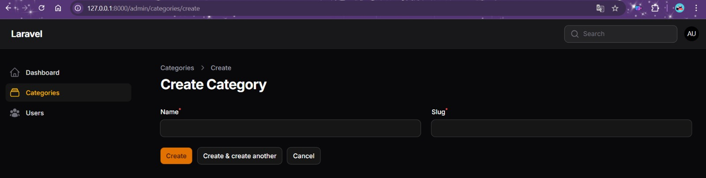

Edit Table Category
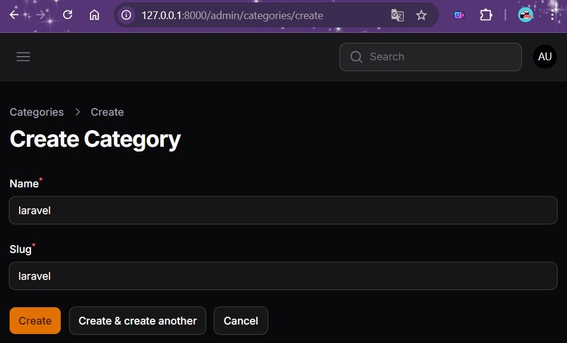

Data berhasil ditampilkan
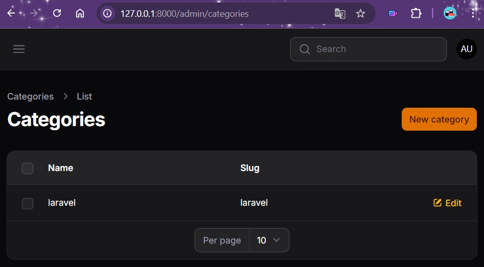

### J. Analisis & Diskusi
1. Mengapa kita perlu $fillable?
2. Apa fungsi $casts pada Laravel?
3. Apa perbedaan integer biasa dengan foreign key?
4. Bagaimana jika category dihapus tetapi masih ada post?

### Jawab:
1. Agar data dapat disimpan menggunakan mass assignment (digunakan oleh Filament).
2. $casts berfungsi untuk mengkonversi tipe data secara otomatis antara database dan PHP, tanpa perlu konversi manual.
3. | Aspek | integer('category_id') | foreignId('category_id') |
    |------|------------|------------|
    | **Fungsi** | Hanya menyimpan angka biasa | Menghubungkan ke tabel lain |
    | **Validasi DB** | Tidak ada | Database menjamin nilai harus ada di tabel referensi |
    | **Proteksi** | Bisa isi angka sembarang | Tidak bisa isi ID yang tidak ada di tabel categories |
4. Bergantung pada pengaturan foreign key-nya. Ada 3 kemungkinan perilaku:
a) Tanpa foreign key (integer biasa) → Post tetap ada dengan category_id yang sudah tidak valid (data orphan / data yatim). Ini berbahaya karena bisa error saat relasi dipanggil.
b) Foreign key dengan onDelete('restrict') → Database menolak penghapusan category selama masih ada post yang merujuk ke sana.
c) Foreign key dengan onDelete('cascade') → Semua post yang memiliki category tersebut ikut terhapus otomatis.