# LAPORAN PRAKTIKUM JOBSHEET-07

## Pertemuan 7 – Implementasi Wizard Form (Multi Step Form) di Filament
### B. Struktur Database Product
Buat file migrate product dan lakukan migrate ke database
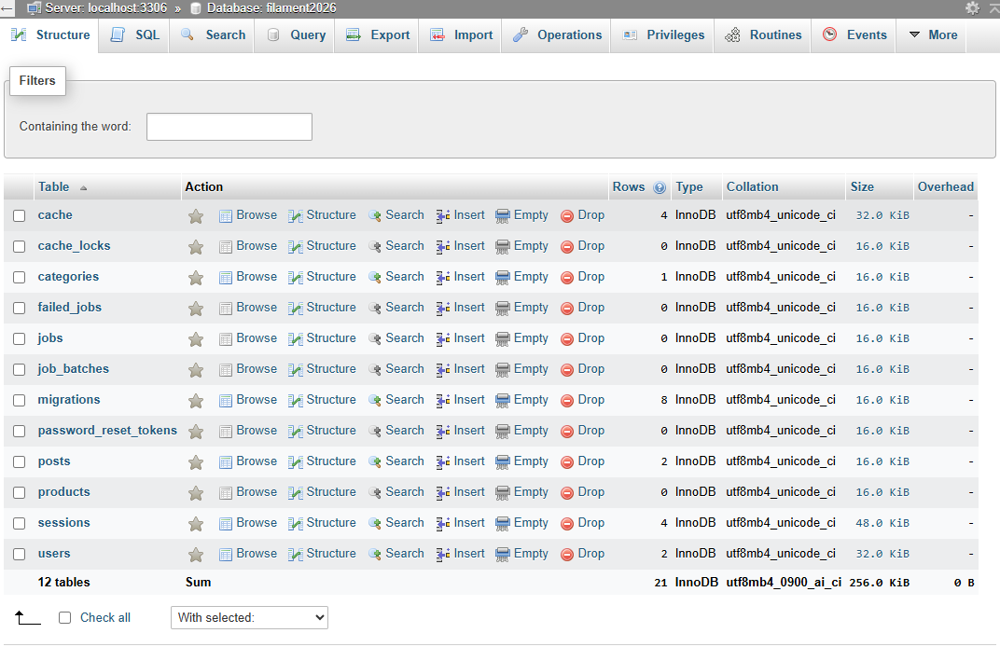

Buat File Model
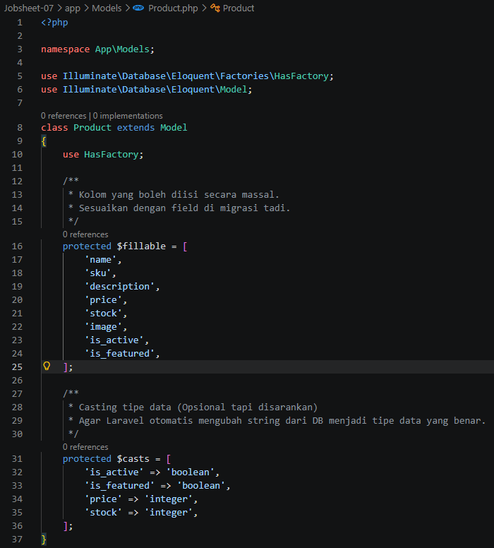

### C. Membuat Resource Product
Menu Products muncul
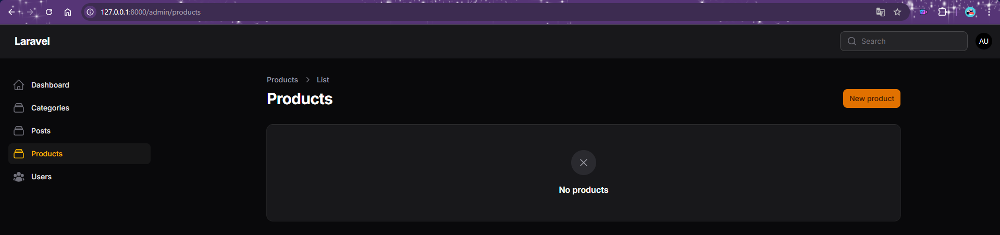

### D. Implementasi Wizard Form
Muncul Menu 1, yaitu Product Info
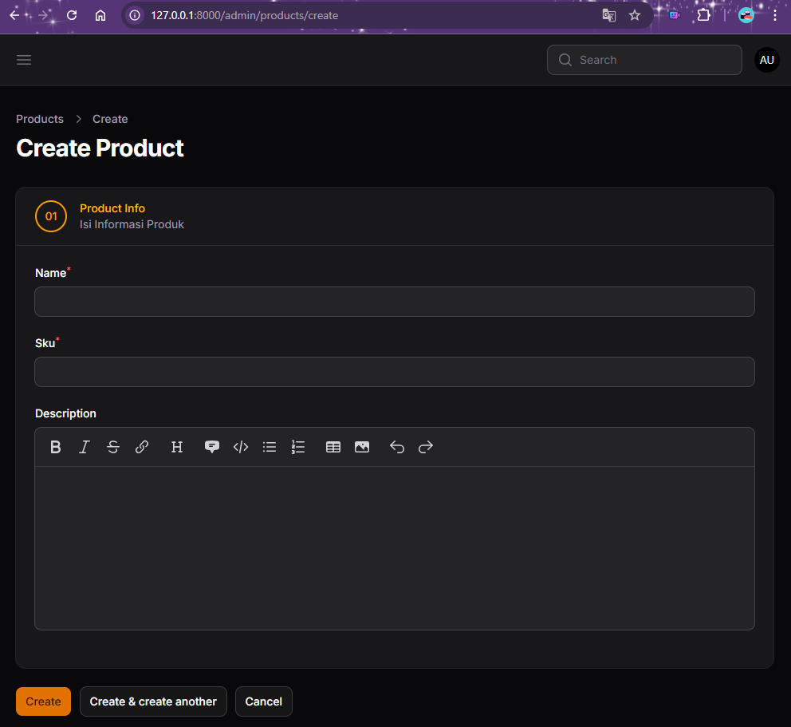

Muncul Menu 2, yaitu Pricing & Stock
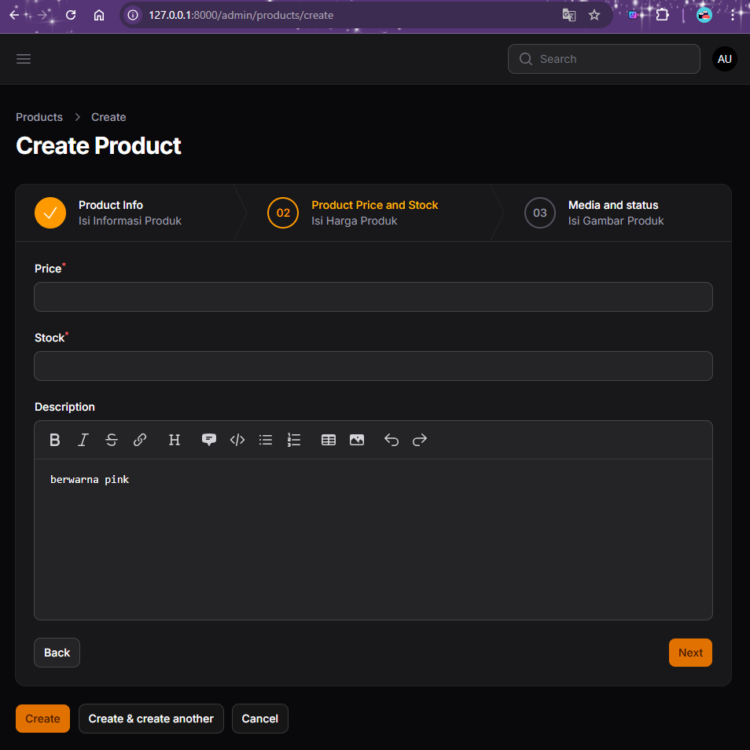

Muncul Menu 3, yaitu Media & Status
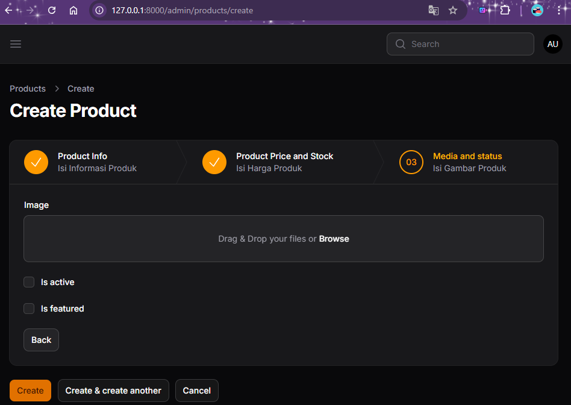

### E. Menambahkan Tombol Submit
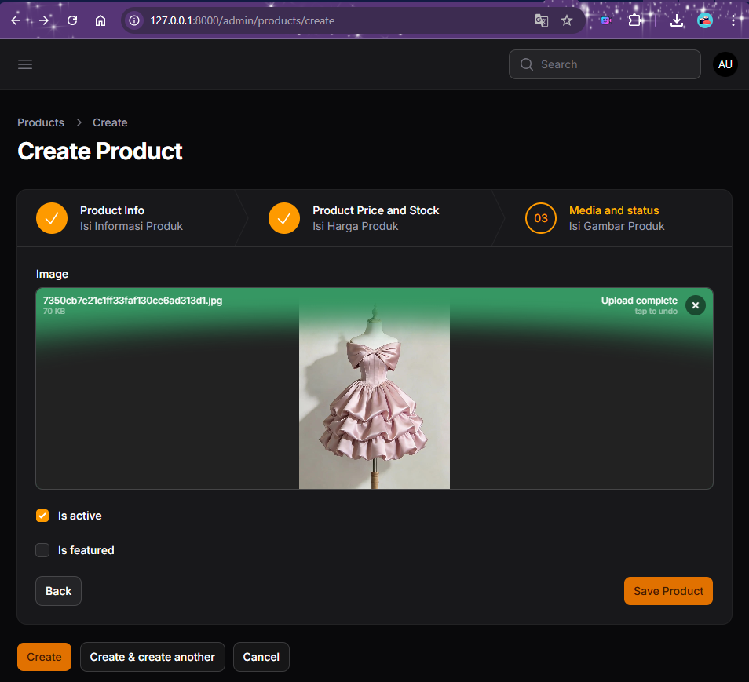

### F. Menghilangkan Default Button
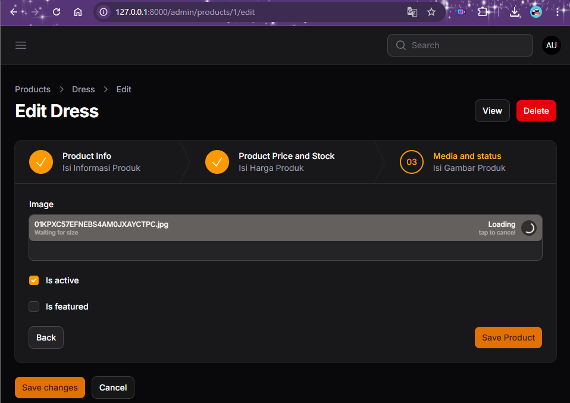

### G. Tampilan Wizard Form
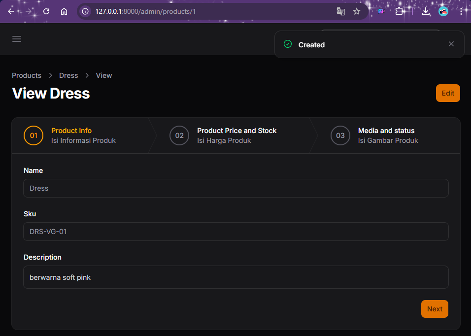

### I. Menampilkan Data pada Table
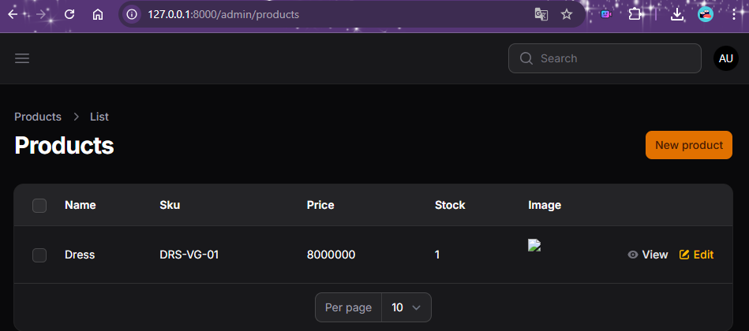
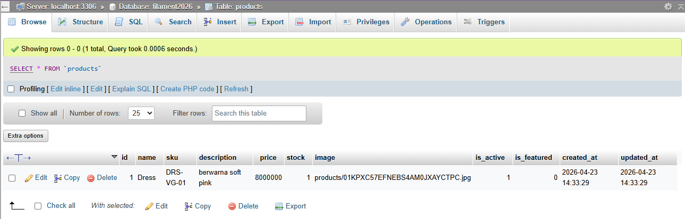

### L. Analisis & Diskusi
1. Mengapa Wizard Form lebih baik untuk form panjang?
2. Kapan kita menggunakan skippable()?
3. Apa kelebihan multi step dibanding single form panjang?
4. Apakah wizard cocok untuk semua jenis form?

### Jawab:
1. Karena membagi beban kognitif pengguna. Dibandingkan melihat satu halaman penuh dengan puluhan kolom yang membosankan, Wizard Form memecah tugas menjadi potongan-potongan kecil yang terasa lebih ringan dan mudah diselesaikan.
2. Gunakan saat urutan pengisian data bersifat opsional. Dengan skippable(), pengguna bisa langsung melompat ke langkah (step) mana pun tanpa harus mengisi langkah sebelumnya secara berurutan. Ini cocok untuk form profil pengguna yang tidak semua datanya wajib diisi saat itu juga.
3. Kelebihan multi step dibanding single form panjang
- Fokus: Pengguna hanya fokus pada satu kategori data dalam satu waktu.
- Organisasi: Data terkelompok secara logis (misal: Info Produk -> Harga -> Media).
- Progres: Ada indikator visual yang menunjukkan sejauh mana pengguna sudah melangkah, sehingga mereka tidak merasa terjebak dalam form yang "tak berujung".
4. Tidak. Wizard cocok untuk form kompleks (pendaftaran asuransi, input produk detail, checkout belanja).
Wizard tidak cocok untuk form sederhana (login, kontak kami, atau survei 2-3 pertanyaan). Menggunakan Wizard pada form pendek justru akan menambah klik yang tidak perlu dan memperlambat pengguna.

## Pertemuan 8 – Implementasi Info List (View Page) di Filament
### D. Membuat Section – Product Info
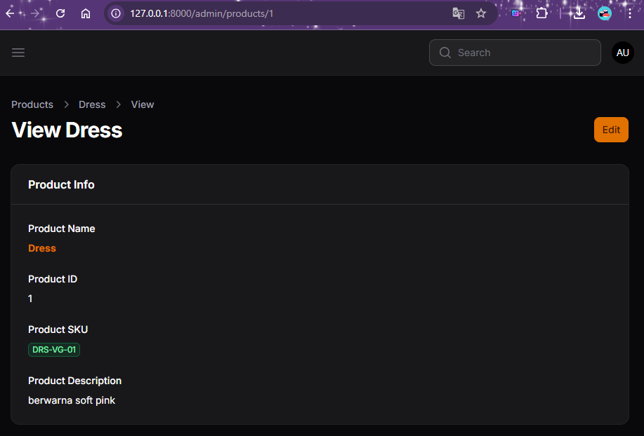

### E. Section – Pricing & Stock 
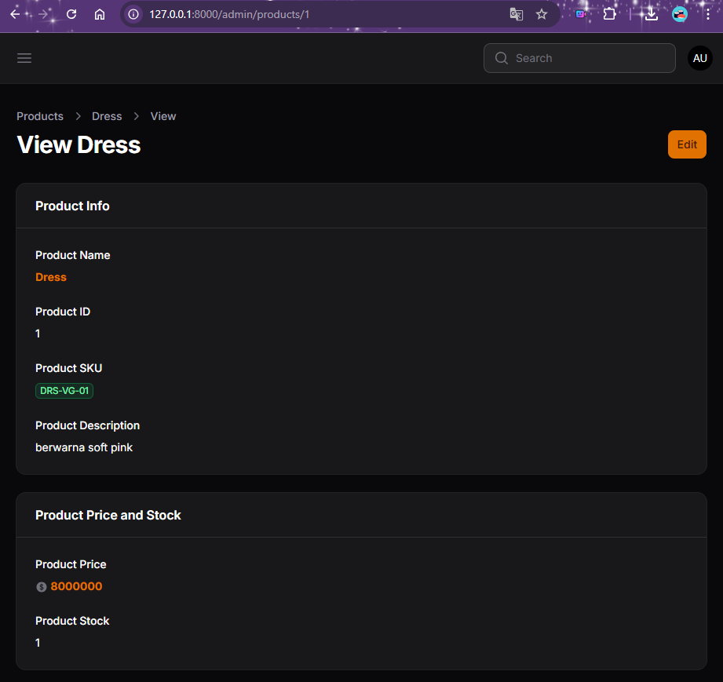

### F. Section – Media & Status
Menampilkan Gambar
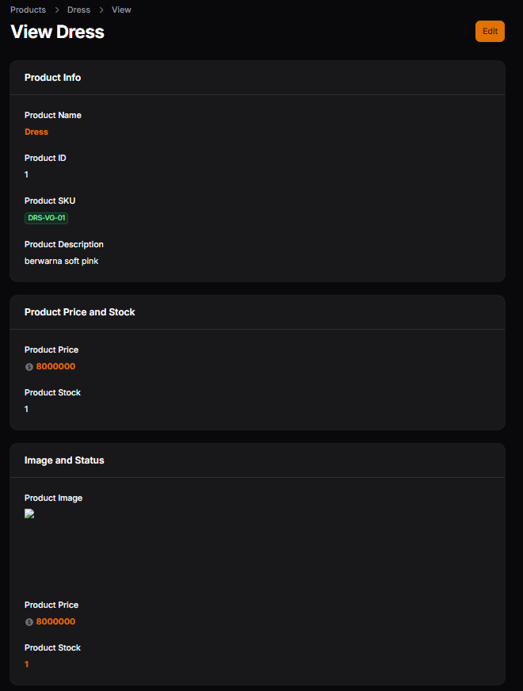

Menampilkan Status Boolean
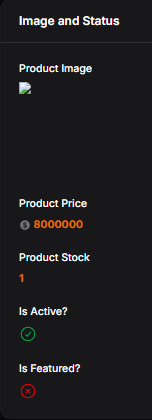

Menampilkan Tanggal dengan Format
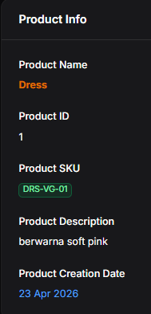

### L. Analisis & Diskusi
1. Mengapa View Page tidak cocok menggunakan form input?
2. Apa perbedaan TextColumn dan TextEntry?
3. Kapan kita menggunakan badge?
4. Apa keuntungan menggunakan IconEntry untuk boolean?

### Jawab:
1. Halaman View bertujuan untuk menampilkan data (read-only) tanpa risiko terubah secara tidak sengaja. Menggunakan form input (seperti TextInput) di halaman View akan membingungkan pengguna karena mereka akan mencoba mengetik di sana, padahal datanya tidak akan tersimpan.
2. Keduanya menampilkan teks, namun tempat penggunaannya berbeda:
- TextColumn: Digunakan di dalam Table (halaman daftar data/Index) untuk menampilkan data dalam baris dan kolom.
- TextEntry: Digunakan di dalam Infolist (halaman detail/View) untuk menampilkan satu data spesifik secara vertikal atau dalam grid.
3. Gunakan badge() saat kamu ingin menonjolkan informasi yang berupa status, kategori, atau label pendek.
- Contoh: Status stok ("Tersedia"), kategori produk ("Elektronik"), atau SKU.
- Fungsi: Memberikan latar belakang warna (seperti kapsul) agar mata pengguna langsung tertuju pada informasi penting tersebut dibanding teks biasa.
4. Dibandingkan menampilkan teks "Ya" atau "Tidak", IconEntry jauh lebih unggul karena:
- Kecepatan Visual: Otak manusia memproses ikon (centang hijau/silang merah) jauh lebih cepat daripada membaca teks.
- Hemat Ruang: Ikon jauh lebih ringkas.
- Estetika: Membuat tampilan Dashboard terlihat lebih modern dan profesional.

## Pertemuan 9 – Implementasi Tabs pada Info List di Filament
### D. Implementasi Tabs
Tab Product Info
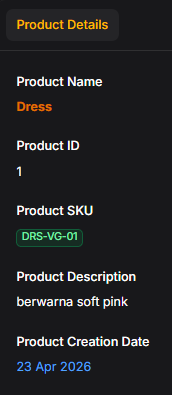

Tab Pricing & Stock
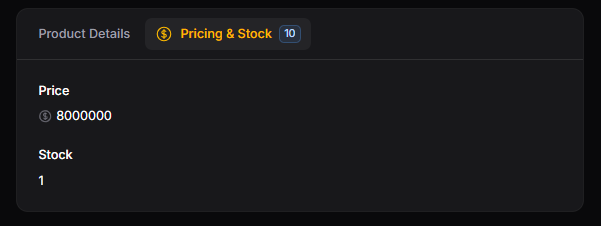

Tab Media & Status
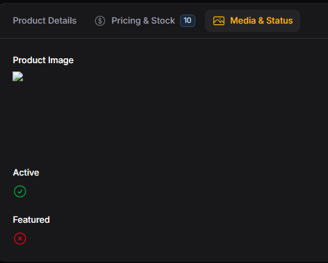

### E. Tampilan Tabs Horizontal
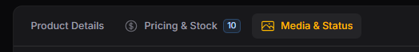

### F. Mengubah Tabs Menjadi Vertical
Tampilan Tabs Vertical
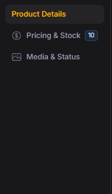

### K. Analisis & Diskusi
1. Kapan kita menggunakan Tabs dibanding Section?
2. Apa kelebihan Tabs untuk data panjang?
3. Apakah Tabs bisa digunakan pada Form juga?
4. Bagaimana jika tab terlalu banyak?

### Jawab:
1. Penggunaan Tabs dan Section:
- Gunakan Section: Jika informasi Anda masih cukup ringkas (bisa discroll dengan cepat) dan ingin semua data terlihat langsung saat halaman dibuka.
- Gunakan Tabs: Jika Anda memiliki banyak kategori informasi yang berbeda namun setara tingkatannya. Misalnya, memisahkan "Detail Produk", "Analitik Penjualan", dan "Riwayat Stok".
2. Tabs sangat efektif untuk menjaga kebersihan tampilan (UI Cleanliness). Daripada pengguna harus melakukan scrolling yang melelahkan ke bawah, mereka cukup mengklik tab yang relevan. Ini membuat pengguna tidak merasa kewalahan saat melihat data yang sangat banyak dalam satu halaman.
3. Ya, tentu saja. Penggunaannya sangat mirip dengan di Infolist. Anda bisa mengelompokkan input form ke dalam tab agar form tidak terlihat mengintimidasi. Bedanya, di Form Anda menggunakan Filament\Forms\Components\Tabs, sedangkan di Infolist menggunakan Filament\Infolists\Components\Tabs.
4. Jika jumlah tab sudah melebihi lebar layar (terutama di perangkat mobile), Filament secara otomatis akan menangani navigasinya (biasanya menjadi scrollable horizontal atau menggunakan menu dropdown tergantung versi dan kustomisasi). Namun, dari sisi User Experience (UX), jika tab sudah lebih dari 5-7 buah, sebaiknya Anda mempertimbangkan untuk mengelompokkan kembali data tersebut atau menggunakan sistem navigasi yang berbeda agar tidak membingungkan.