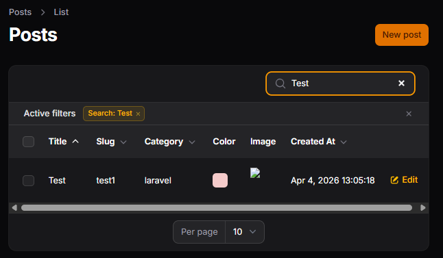
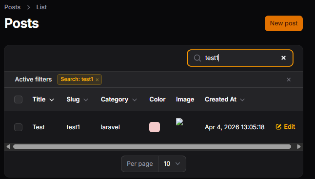
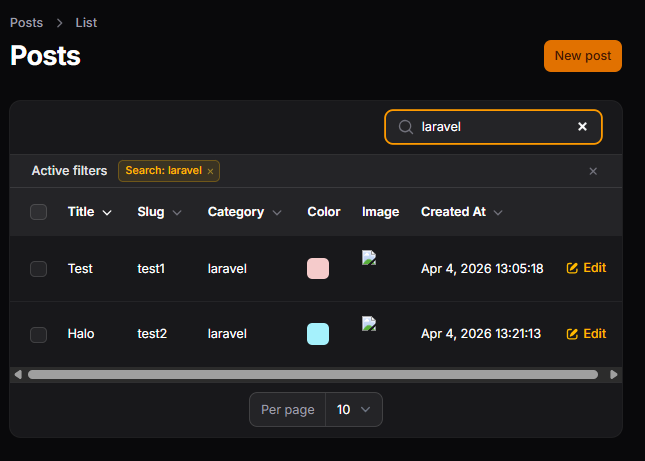
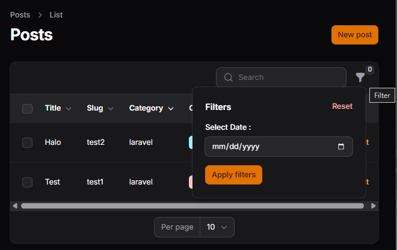
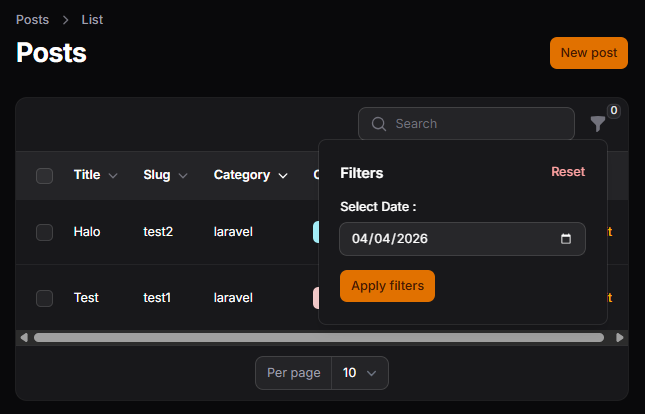
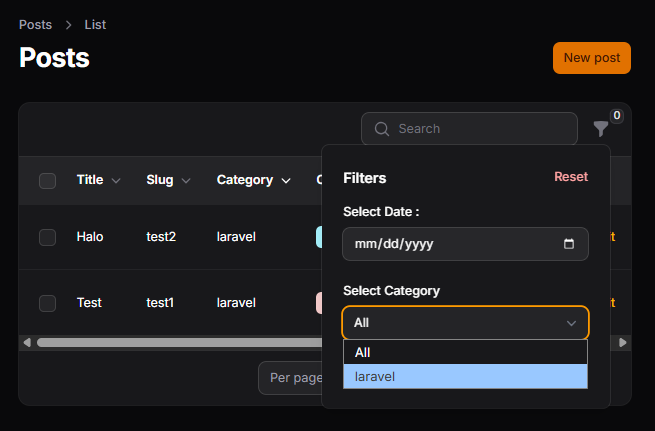

# LAPORAN PRAKTIKUM JOBSHEET-11

## Pertemuan 11 – Implementasi Search & Filter pada Table Filament
### B. Menambahkan Search pada Kolom
Search pada Title

Search pada Slug

Search pada Relasi Category

### C. Membuat Filter Berdasarkan Tanggal
Tambahkan Filter Created At

Menambahkan Query Logic

### D. Membuat Filter Berdasarkan Relasi (Kategori)

### H. Analisis & Diskusi
1. Mengapa search tidak cocok untuk filter tanggal?
2. Apa fungsi relationship() pada SelectFilter?
3. Mengapa kita perlu whereDate() pada query filter?
4. Apa perbedaan searchable() dan filters()?

### Jawab:
1. Karena fitur searchable() bekerja dengan mencocokkan teks (string) secara umum. Format tanggal di database (misal: 2023-12-31 14:00:00) sangat kaku. Jika admin mencari "Desember" atau "Minggu lalu" di kolom pencarian, sistem tidak akan menemukannya karena pencarian teks tidak mengerti konsep waktu, hanya mencocokkan karakter. Itulah mengapa menggunakan DatePicker agar admin bisa memilih tanggal yang pasti dari kalender.
2. Fungsi relationship() digunakan untuk menghubungkan filter langsung dengan tabel lain.
- Contoh: relationship('category', 'name') memberitahu Filament untuk mengambil semua daftar kategori dari tabel categories dan menampilkan nama-namanya di menu dropdown filter. Jadi, admin tidak perlu menghafal ID kategori, cukup pilih namanya.
3. Data tanggal di database biasanya bertipe DateTime (ada jam, menit, dan detiknya). Jika kita hanya mencari "2023-12-31", pencarian biasa mungkin gagal karena ada tambahan waktu di belakangnya. whereDate() memerintahkan database untuk mengabaikan jam/menit/detik dan hanya membandingkan tahun, bulan, serta harinya saja agar hasilnya akurat.
4. Meskipun keduanya sama-sama untuk mencari data, tujuannya berbeda:
- searchable(): Digunakan untuk pencarian cepat berdasarkan kata kunci teks (seperti judul atau SKU) pada kolom tertentu.
- filters(): Digunakan untuk penyaringan spesifik berdasarkan kriteria tertentu yang sudah ditentukan (seperti rentang tanggal, kategori tertentu, atau status aktif/tidak).