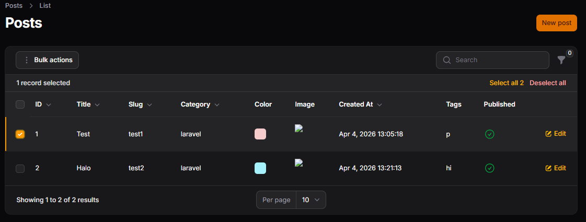
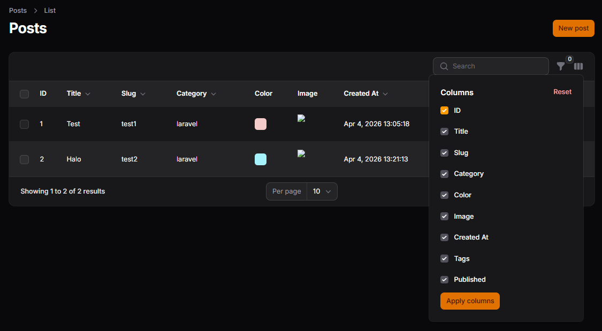
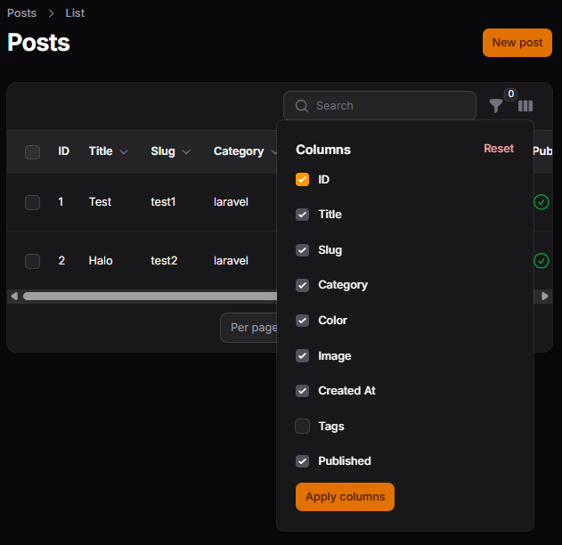
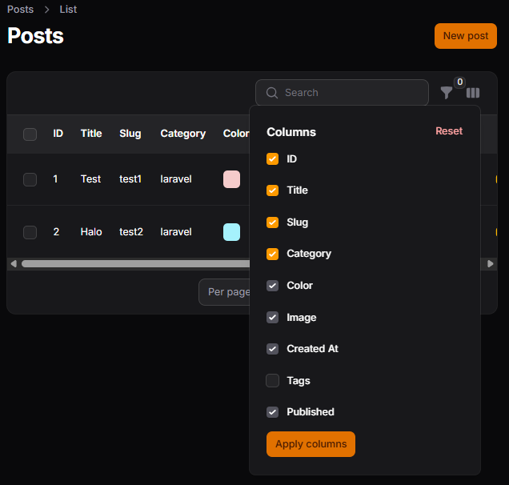

# LAPORAN PRAKTIKUM JOBSHEET-12

## Pertemuan 12 – Implementasi Toggle Column pada Table Filament
### B. Menambahkan Kolom Baru

### C. Mengaktifkan Toggle Column

### D. Menyembunyikan Kolom Secara Default

### F. Menerapkan Toggle pada Semua Kolom

### J. Analisis & Diskusi
1. Mengapa toggle column penting pada admin panel?
2. Apa perbedaan toggleable() biasa dengan isToggledHiddenByDefault?
3. Mengapa preferensi kolom tetap tersimpan?
4. Kapan sebaiknya kolom disembunyikan secara default?

### Jawab:
1. 