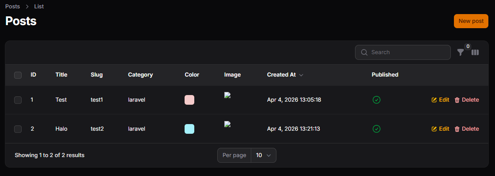
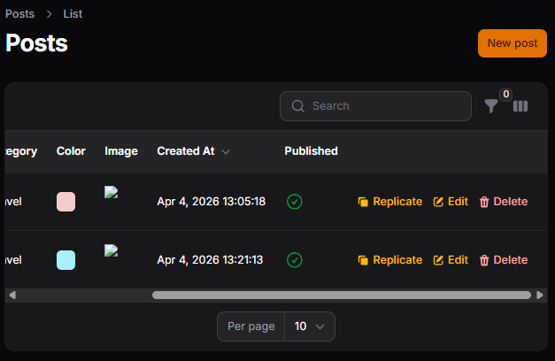
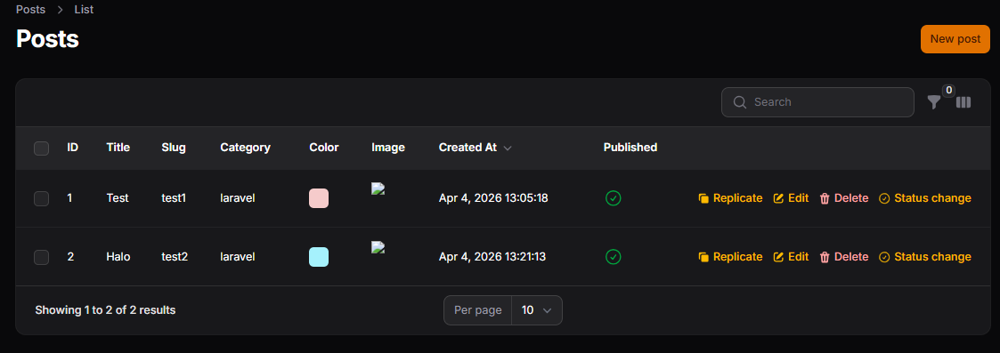

# LAPORAN PRAKTIKUM JOBSHEET-12

## Pertemuan 12 – Implementasi Toggle Column pada Table Filament
### B. Menambahkan Kolom Baru

### C. Menambahkan Replicate (Copy) Action

### E. Membuat Custom Action (Ubah Status Publish)

### J. Analisis & Diskusi
1. Mengapa action di tabel lebih efisien dibanding halaman edit?
2. Apa perbedaan predefined action dan custom action?
3. Bagaimana cara menambahkan validasi dalam custom action?
4. Kapan kita menggunakan Replicate?

### Jawab:
1. 