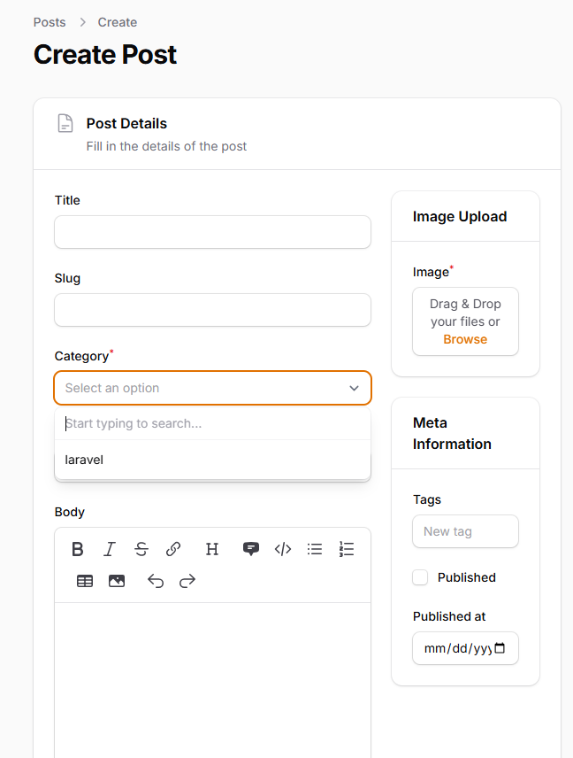
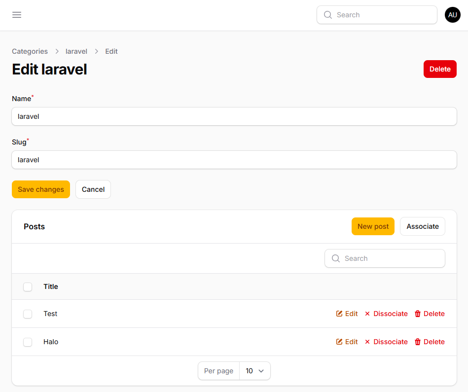
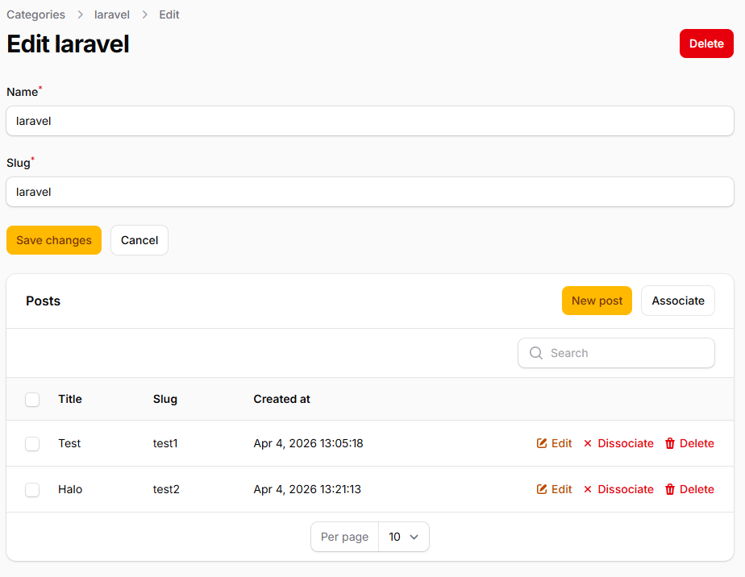

# LAPORAN PRAKTIKUM JOBSHEET-14

## Pertemuan 14 – Implementasi Relation pada Filament (HasMany)
### D. Membuat Dropdown Searchable

### I. Hasil Relationship Manager

### J. Menambahkan Kolom pada Relationship Table

### O. Analisis & Diskusi
1. Apa perbedaan relationship() dengan options()?
2. Mengapa searchable penting untuk dataset besar?
3. Apa fungsi Relationship Manager pada Filament?
4. Kapan menggunakan HasMany dan BelongsTo?

### Jawab:
1. relationship() vs options(): relationship() digunakan untuk melakukan query secara dinamis ke database berdasarkan relasi Eloquent, sedangkan options() digunakan untuk menyuplai daftar opsi secara statis dari array.
2. Karena membantu performa aplikasi karena data hanya diload dari database (server-side per request/AJAX) ketika pengguna mencari kata kunci. Tanpanya, browser dapat hang jika memuat puluhan ribu record sekaligus ke dropdown.
3. Fungsi Relationship Manager: Mempermudah pengelolaan CRUD atau attach/detach data berelasi di satu layar (misal: mengelola data Post spesifik kategori tersebut langsung di halaman edit Category).
4. HasMany vs BelongsTo: HasMany digunakan di model Parent (yang tabel databasenya tidak meletakkan foreign key), contohnya Kategori memiliki banyak Post. Sebaliknya, BelongsTo digunakan di model Child (yang tabel databasenya menampung foreign key category_id), contohnya Post milik sebuah Kategori.