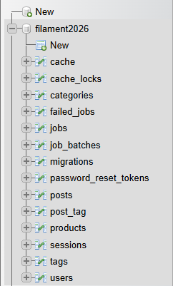
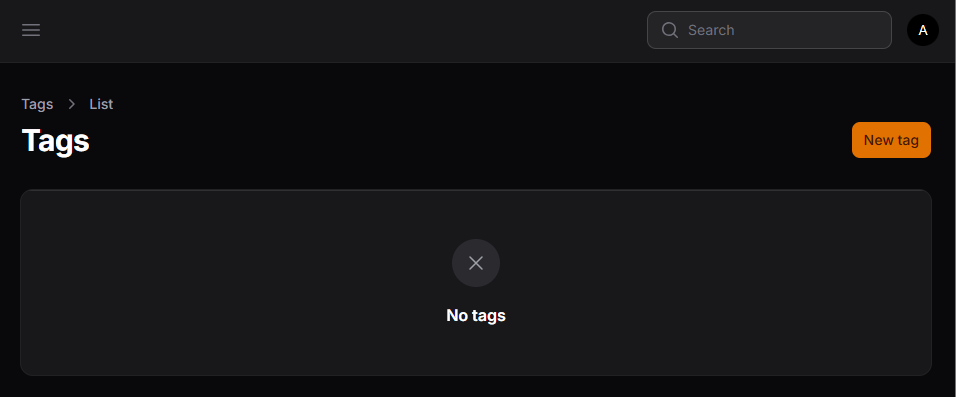
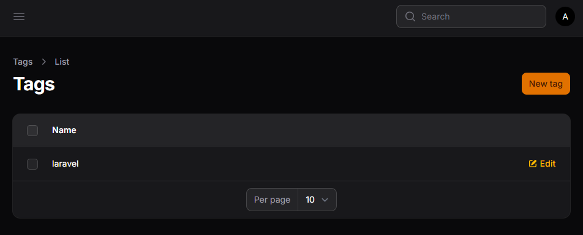
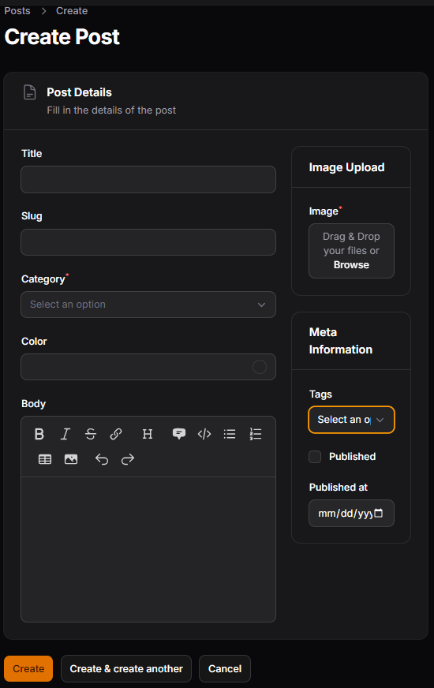
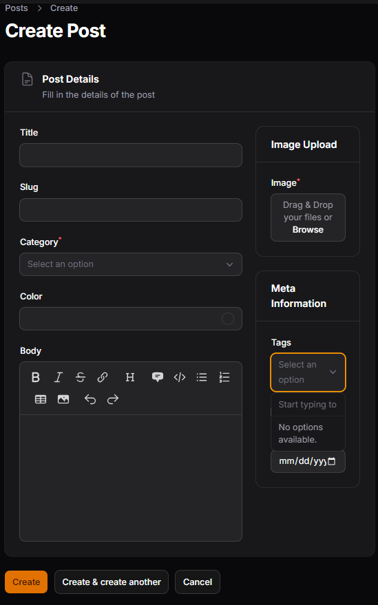
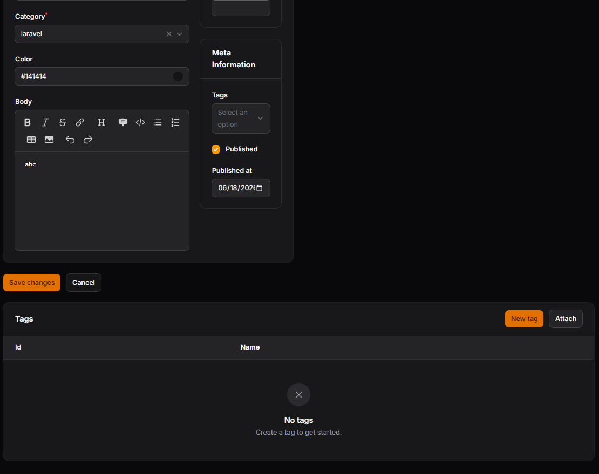

# LAPORAN PRAKTIKUM JOBSHEET-15

## Pertemuan 15 – Implementasi Many-to-Many Relationship pada Filament
### D. Rollback Migration

### F. Membuat Pivot Table

### H. Membuat Model Tag

Form Tag

Table Tag

### L. Hasil Form Post

Tambahkan function multiple() untuk membuat field Select bisa memilih lebih dari satu data.

### O. Fitur Relationship Manager

### T. Analisis & Diskusi
1. Apa perbedaan HasMany dan Many-to-Many?
2. Mengapa pivot table diperlukan?
3. Apa fungsi attach dan detach pada Filament?
4. Mengapa JSON column kurang baik untuk relasi?

### Jawab:
1. Perbedaan HasMany dan Many-to-Many:
   - HasMany (One-to-Many): Sebuah record di Tabel A bisa memiliki banyak record di Tabel B, tetapi record di Tabel B hanya terikat pada SATU record dari Tabel A saja. (Dalam hal ini, foreign key diletakkan di Tabel B). Contoh kasus: Satu Category bisa memiliki banyak Post.
   - Many-to-Many: Sebuah baris data di Tabel A bisa memiliki banyak relasi di Tabel B, dan sebaliknya baris data di Tabel B juga bisa memiliki banyak relasi dengan pendataan di Tabel A. Contoh kasus: Sebuah Post memiliki banyak Tag, dan satu  Tag  bisa digunakan pada banyak  Post .

2. Mengapa Pivot Table diperlukan?  
   Dalam database relasional yang terstruktur (RDBMS/SQL), tidak memungkinkan menempelkan banyak  foreign key  di dalam sebuah kolom tabel untuk memetakan hubungan banyak-ke-banyak (akan menyalahi aturan  First Normal Form  / 1NF database). Pivot table mengatasi masalah ini dengan berfungsi sebagai "jembatan" atau tabel ketiga yang memuat daftar kombinasi Primary Key dari ke-2 tabel utama tersebut (misal tabel `post_tag` yg memuat `post_id` dan `tag_id`).

3. Fungsi Attach dan Detach (pada Filament / Laravel Eloquent):
   - Attach: Berfungsi untuk menautkan dan memasukkan data relasional baru; mendaftarkan kaitan kedua row data ke dalam entitas pivot table.
   - Detach: Berfungsi untuk melepas tautan antar data yang berada di pivot table tanpa menghapus  master records -nya di masing-masing tabel utama.

4. Mengapa JSON Column Kurang Baik untuk Relasi?  
   - Kurangnya Integritas Referensial (Data Integrity): Database tidak bisa menjalankan fitur pengaman Foreign Key Constraint (seperti on update cascade / on delete cascade ). Jika salah satu data induk terhapus, data yang tertulis di dalam JSON tidak akan ikut beraksi layaknya Relational Mapping.
   - Kinerja Query & Indexing Menurun: Meng-query dan men-filter data ke dalam sekumpulan array JSON jauh lebih lambat ketika direlasikan dan kurang bersahabat dengan fitur tabel JOIN konvensional SQL.
   - Kesulitan Manajemen dan Modifikasi Data: Saat terjadi modifikasi massal relasi data, melakukan update/replace pada kolom JSON rentan menyebabkan inkonsistensi struktur ketimbang men-detach/attach melalui Pivot Table . 