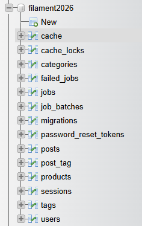
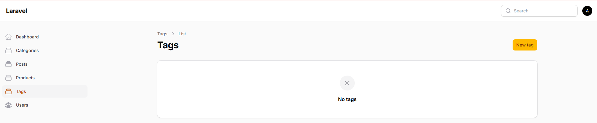

# LAPORAN PRAKTIKUM JOBSHEET-14

## Pertemuan 15 – Implementasi Many-to-Many Relationship pada Filament
### F. Membuat Pivot Table

### H. Membuat Model Tag

### T. Analisis & Diskusi
1. Apa perbedaan HasMany dan Many-to-Many?
2. Mengapa pivot table diperlukan?
3. Apa fungsi attach dan detach pada Filament?
4. Mengapa JSON column kurang baik untuk relasi?

### Jawab:
1. 